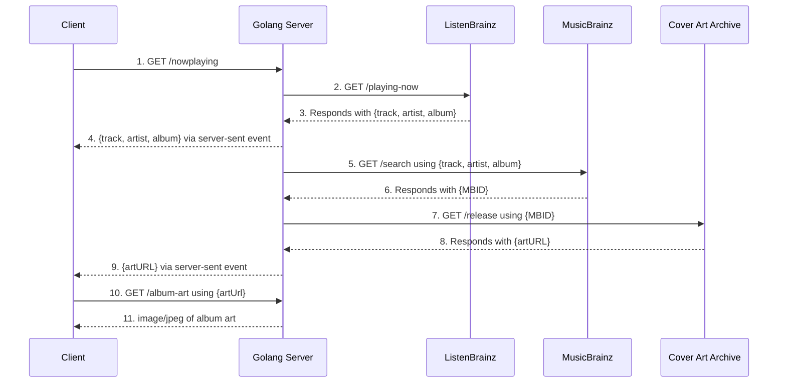

# 🚀 jl8n.dev

My personal developer webapp showcasing some of my development chops using some of my favorite technologies.

The current build can be viewed at [jl8n.dev](https://jl8n.dev).

## 📚 Tech Stack

### Backend
- **Go**
  - Go-chi API: Server-side events and HTTP requests.
- **MongoDB**
- **GraphQL**

### Frontend
- **Typescript**
- **Svelte & Sveltekit**


### Docker 🐳

Both the frontend and backend are dockerized as part of a CI/CD pipeline.


## 📦 Installation & Usage

### Run

Simply use `docker compose` to pull the latest Docker images and run the `web` and `server` containers:

```bash
docker compose up -d
```

Or using `docker run`:

```bash
docker run -d --name jl8n.dev-web -p 3001:80 ghcr.io/jl8n/jl8n.dev/web:latest
docker run -d --name jl8n.dev-server -p 3000:3000 ghcr.io/jl8n/jl8n.dev/server:latest
```

Then navigate to http://localhost:3001 in a browser.

### Dev

Run the Vite development server:

```bash
cd web/
pnpm dev
```

Run the Go API service:

```bash
cd /server
go run .
```

### Build

Build the Sveltekit webapp:

```bash
cd web/
pnpm run build
```

Build the Go app backend service:

```bash
cd server/
go build
```

## 🏗️ Architecture

Admit it, this is why you're here.

### Currently Playing Song

To constantly display the song that I'm listening to I have to first set up a "scrobbling" service, in my case [ListenBrainz](https://listenbrainz.org). This records the songs that I listen to on my music streaming service via an app on my phone and a browser extension on my PC to their internal, queryable database. 

The currently-playing song functionality works by periodically querying the ListenBrainz API, which conveniently has a `/playing-now` endpoint which supplies currently-playing song metadata only if I'm currently listening to music.

However, getting the album art is a bit more tricky. To accurately and consistently get the correct artwork in high quality I'm using the MusicBrainz API (the parent project of ListenBrainz) to correctly "match" the song+artist+album combo to one of the records in their database. Doing this is complicated by two main factors: that many album releases will have multiple versions with different album art (Deluxe edition, Japanese bonus tracks, etc.), as well as the fact that the MusicBrainz database will inexplicably have lots of nearly identical records for the same album — except some of them either don't have any album art or will have lower-quality art compared to other results.  
It then becomes necessary to develop some sort of ["rudimentary" decision algorithm](https://github.com/jl8n/jl8n.dev/blob/1ff331636cd09496741a30bd1a7749a4823ca432/server/albumArt.go#L90-L143) to choose the fittest result. As of writing this, my current implementation is embarassing, so hopefully I'll get around to making it better (training an AI to choose the best result could be fun but I doubt I'll spend the time when it already works decently well) — so if you're reading this cheers from the commit history.

The logic flow is a little involved due to the complications created by retrieving alabum art, but it does work and it works well dare I say.

Here's a diagram:


