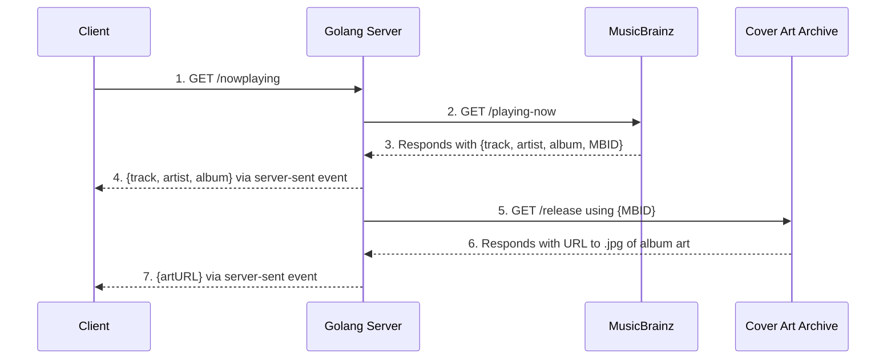

# jl8n.dev Server

```mermaid
sequenceDiagram
    participant Client
    participant Server as Golang Server
    participant MusicBrainz as MusicBrainz
    participant CoverArt as Cover Art Archive

    Client->>Server: 1. GET /nowplaying
    Server->>MusicBrainz: 2. GET /playing-now
    MusicBrainz-->>Server: 3. Responds with {track, artist, album, MBID}
    Server-->>Client: 4. {track, artist, album} via server-sent event
    Server->>CoverArt: 5. GET /release using {MBID}
    CoverArt-->>Server: 6. Responds with URL to .jpg of album art
    Server-->>Client: 7. {artURL} via server-sent event
```